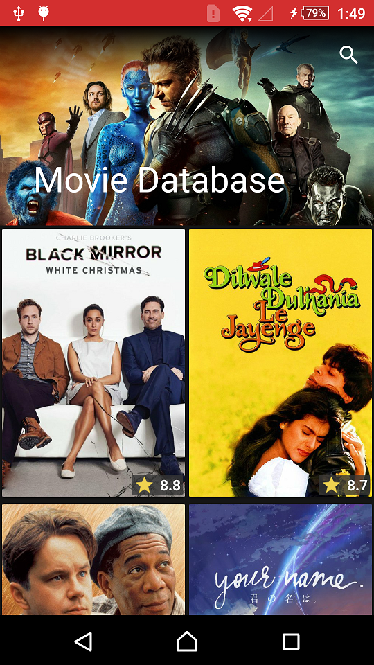
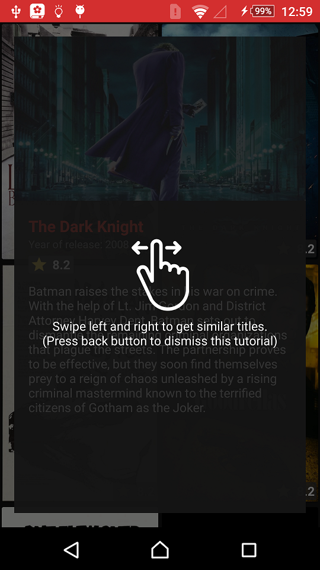
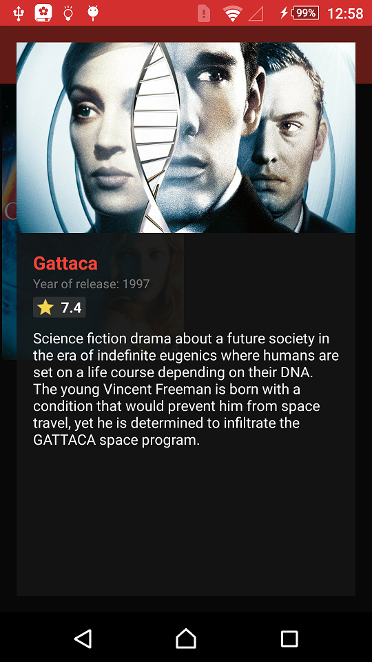

# The Movie Database

The Movie Database API use.

- The main Activity lists the top rated movies using pagination.
- You can search a movie by name.
- Selecting a Movie will show details from it and swiping horizontally will show similar titles.

## What do you need in order to make this work?

You will need to use your own The Movie Database ApiKey. Add it in your `gradle.properties`:

```
the_movie_database_api_key="YOUR KEY"
```

## API calls used

```
https://api.themoviedb.org/3/configuration

https://api.themoviedb.org/3/movie/top_rated

https://api.themoviedb.org/3/movie/{movie_id}/similar

https://api.themoviedb.org/3/search/movie?sort_by=popularity.desc
```

## Design

The design uses a GridLayout with the movie posters. On item click opens a new Activity with the details and the similar titles.

## Architecture

This application uses Clean Architecture with MVP.

## Info

Libraries:

- Picasso
- Butterknife
- RX
- Dagger 2
- Retrofit 2

Android Widgets:

- CoordinatorLayout
- AppBarLayout
- CollapsingToolbarLayout
- Toolbar
- BottomSheetDialogFragment
- SearchView
- SwipeRefreshLayout
- NestedScrollView
- RecyclerView
- ProgressBar

## Tests

Just some simple tests for dates and api keys.

## Screenshots








## License
    Copyright 2017 Esteban Latre
    
    Licensed under the Apache License, Version 2.0 (the "License");
    you may not use this file except in compliance with the License.
    You may obtain a copy of the License at
    
        http://www.apache.org/licenses/LICENSE-2.0
    
    Unless required by applicable law or agreed to in writing, software
    distributed under the License is distributed on an "AS IS" BASIS,
    WITHOUT WARRANTIES OR CONDITIONS OF ANY KIND, either express or implied.
    See the License for the specific language governing permissions and
    limitations under the License.
